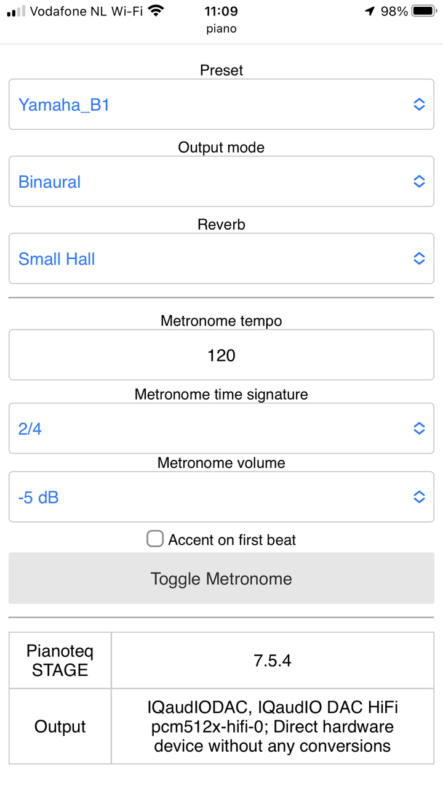

Remote for Pianoteq
===================

This repo constains a single page JavaScript application that is capable of
controlling [Pianoteq](https://www.modartt.com/pianoteq) via the JSON-RPC API
added in Pianoteq 7.5. This is perfect for a Pianoteq installation on something
like a Raspberry Pi (especially for a version with the `PREEMPT_RT` kernel,
tutorial coming soon), allowing you to control Pianoteq over your phone.

The software is written with vanilla JS and very minimal amount of CSS to
ensure that the application is fast even on the lowest end Android devices. I
personally use an older, low-end phone as the controller for my Pianoteq
installation on a Raspberry Pi 4 (with realtime patch).



See forum thread: https://forum.modartt.com/viewtopic.php?id=9073

Feature wishlist:

- I can't seem to load my own custom presets without it saying "preset load
  failed".
- Use PWA to make the app installable on a mobile device via the browser.
- The ability to control reverb presets. With the API available in 7.5, you can
  adjust individual reverb settings but not presets (at least as far as I can
  see).
- Start and stop the metronome as well as setting the tempo. Also not supported
  by 7.5 API as far as I can tell.
- Ability to control the velocity curve preset. Again, not available in the API
  as far as I can tell.

Known issues:

- If an error occurred while changing settings, the UI will be stuck in a
  disabled state. This is because the error handling code hasn't been written
  yet as this is still a proof-of-concept.

Running this
------------

Since this is really just a single HTML page with some CSS and JavaScript,
there are a number of ways to run this. 

I'm also hoping eventually to produce a Raspberry Pi 4 image with this
preinstalled such that all you need to do is to download Pianoteq and activate
it before stowing it away and using it remotely.

Simple way
----------

This repository contains a Python 3 program called `server.py`. This file does
not have any dependencies other than Python 3 (tested on Python 3.8+). To run:

1. Run Pianoteq with the `--serve ""` option flag on. For example: `"./Pianoteq
   7 STAGE" --serve ""` under Linux. It will be similar for Windows.
2. Run `server.py` via Python from this directory. For example: 

```
cd path/to/where/you/downloaded/this/repository
python3 server.py
```

3. Then go to https://localhost:8000 to see the interface. Alternatively, from
   your phone, go to http://[IP-ADDRESS]:8000.

You'll probably want to start this program on boot. You can do that via systemd
service on Linux. Not sure how to do it on Windows, tho.

Running Pianoteq on a different computer than server.py
-------------------------------------------------------

Simply run `python3 server.py --pianoteq-host HOST --pianoteq-port PORT`. See
`python3 server.py -h` for more details.

Advanced way
------------

`server.py` does two things that you have to replicate:

1. Serve `index.html` and everything under the `static` directory in a HTTP
   server.
2. Forward any request (GET and POST) to `/jsonrpc` to the Pianoteq.
3. Serve manifest.webmanifest to make the app installable on a mobile browser.

This can be done via a number of web servers, including nginx. Writing such a
configuration is left as an exercise to the reader.

Credit for the app icon
-----------------------

See: https://forum.modartt.com/viewtopic.php?id=7056
